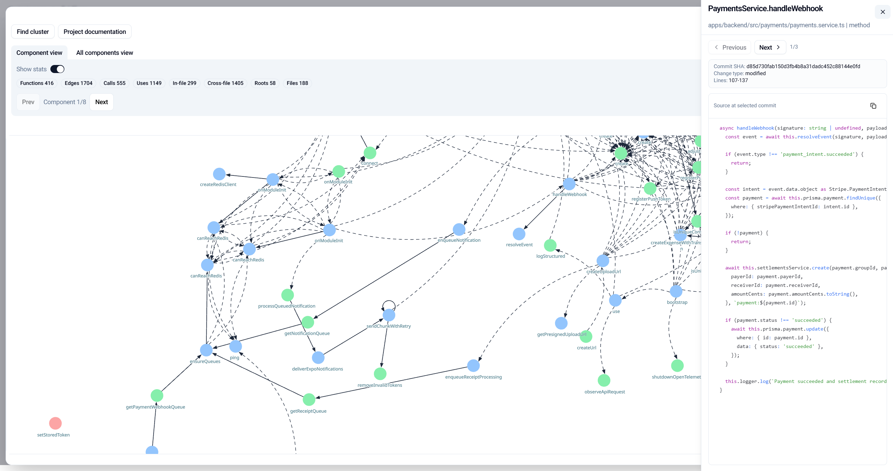
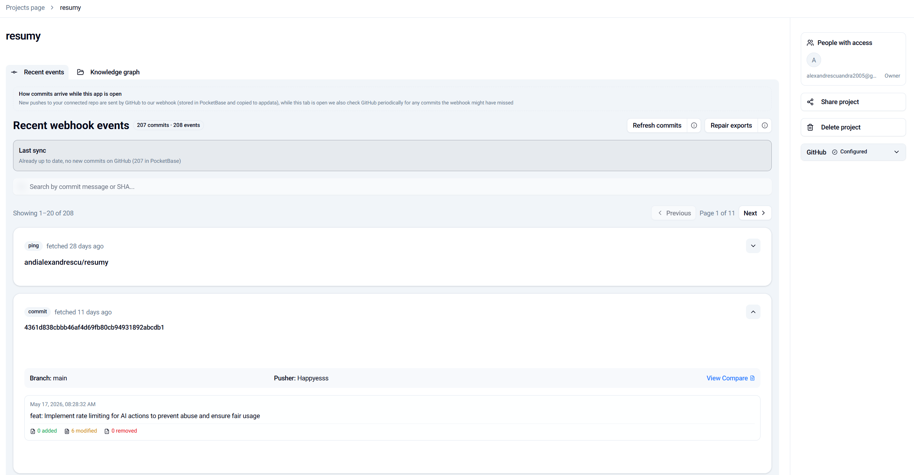
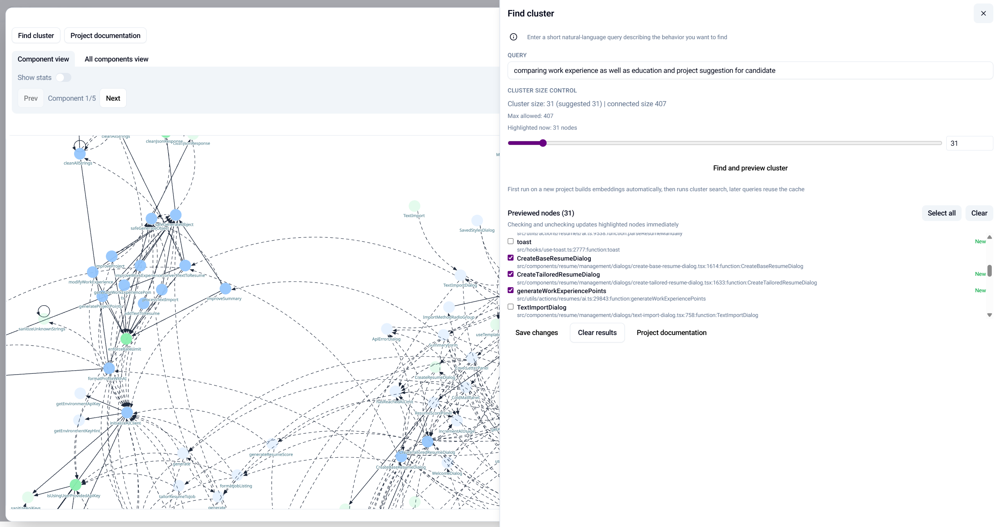
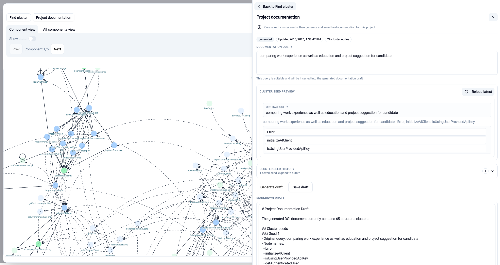
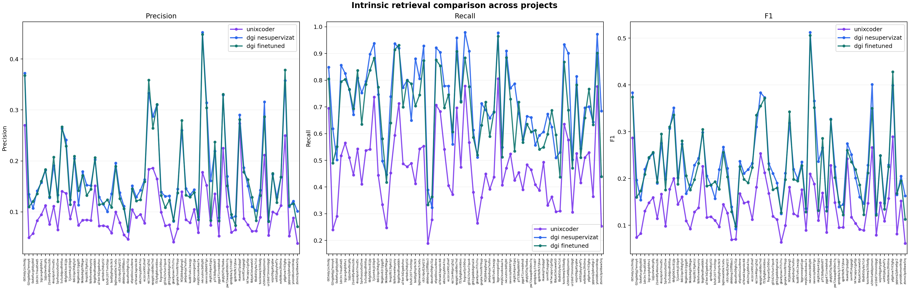
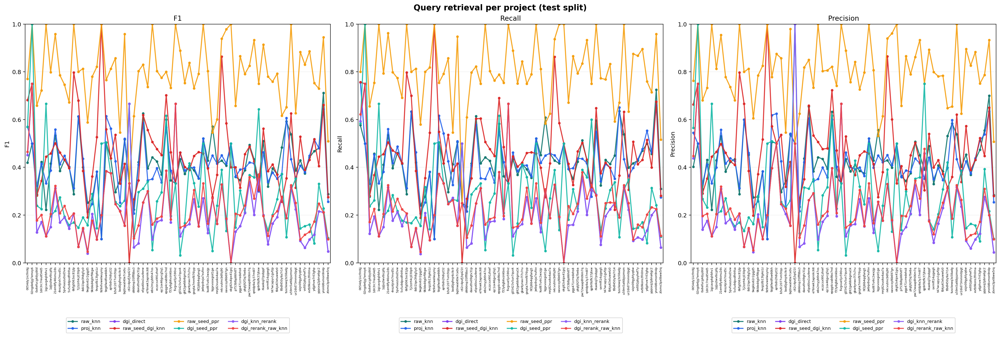
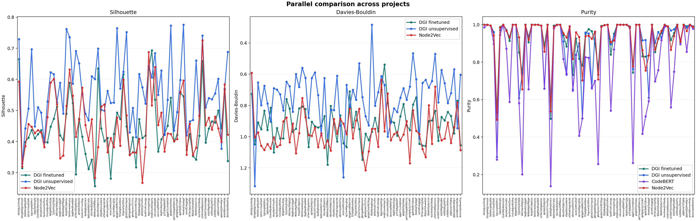

# Log a Priori - Workflow Development Tool

> _ā priōrī_ (Latin) - what comes first, this application reveals underlying insights before they become explicit, by organizing and linking prior information

This project is part of my Bachelor's thesis, done at the Faculty of Mathematics and Informatics, University of Bucharest and it was presented in July of 2026.

The thesis source is in [`docs/lucrare licenta.tex`](docs/lucrare%20licenta.tex). Figures and tables below match **Anexa 1** (experimental evaluations) and **Anexa 2** (application interface) from that document.

---

# Approach

Git history describes version-control changes, but not the logical structure of a codebase. Function-level dependencies, semantic associations and how those entities evolve over commits are usually split across separate tools (call graphs, semantic search, Git viewers).

Log a Priori unifies three layers in one **local-first** desktop application for TypeScript/ JavaScript projects:

| Layer | What it captures | How |
| ----- | ---------------- | --- |
| Structural | Call and reference dependencies among functions | AST parsing with `ts-morph`, visualized with `reagraph` |
| Temporal | How those functions change across commits | GitHub webhooks + local Git snapshots overlaid on the graph |
| Semantic | Task relevance and thematic grouping | UniXcoder embeddings, DGI graph encoding, personalized PageRank search, agglomerative clustering |

Semantic understanding is not a side search engine: node embeddings live on the same graph used for navigation and documentation. Unsupervised **Deep Graph Infomax (DGI)** is extended with query–node pairs so representations can support both structural neighbourhood recovery and natural-language retrieval.

**Scope** Static analysis currently targets TypeScript/ JavaScript only. Analytical artifacts (graphs, embeddings, commit snapshots, documentation) stay on the user's machine, PocketBase stores accounts, credentials, webhook events and sharing metadata.

---

Here is the updated **Documents** table (now including the presentation and the demo video) followed by a new **Demo** section placed immediately after it.

---

# Documents

| Document | Location |
| -------- | -------- |
| Bachelor's thesis (LaTeX) | [`docs/lucrare licenta.tex`](docs/lucrare%20licenta.tex) |
| Research paper (PDF) | [`docs/Research paper.pdf`](docs/Research%20paper.pdf) |
| Thesis presentation (PPT) | [`docs/prezentare licenta.pptx`](docs/prezentare%20licenta.pptx) |
| Evaluation figures | `docs/intrinsic_retrieval_connected_dots.png`, `docs/retrieval_evaluation_inductive_test_per_project.png`, `docs/clustering_comparison.png` |
| Interface screenshots | `docs/knowledge-graph.png`, `docs/webhook-events.png`, `docs/find-cluster.png`, `docs/project-documentation.png` |
| Demo video | [`docs/demo.mov`](docs/demo.mov) |

---

# Demo

A short walkthrough of the application, recorded as `docs/demo.mov`. It shows the full pipeline end-to-end: selecting a project, building the structural graph, syncing commits from GitHub, running a natural-language query to retrieve a cluster, and generating an editable documentation draft.

[](https://youtu.be/PP0s95aX2w8)

**Direct link:** [https://youtu.be/PP0s95aX2w8](https://youtu.be/PP0s95aX2w8)

---

# Main features

It represents a **local-first desktop application** that turns a TypeScript/JavaScript codebase into a **structural, semantic, and temporal knowledge graph**. The application defines code intelligence along three layers, while each layer is motivated by a limitation of the preceding one and is supported by a dedicated technical pipeline as it follows:

- **Structural layer - dependencies among functions**  
  _motivation:_ part of a coding project, the file hierarchy alone does not expose how functions depend on one another, meaning that a graph based visualization is needed in order to navigate the codebase as a network of nodes and edges, providing an explicit visual form for sourcecode that otherwise does not explicitly reveal on its own the calling relationships between functions in the manner of a call stack
  _implementation:_
  - the graph consists of **nodes** represented by codebase extracted functions, while the **edges** are callss between the functions in order to define a strong association between related functions in terms of how the code was structured logically -`ts-morph` is used to parse TypeScript/JavaScript source code into ASTs and it extracts **nodes** (top-level functions, class methods, function expressions) and **edges**, defined as `CALLS` (direct invocations, including JSX component usage) and `USES` (callbacks, middleware, `require` imports) relationships
  - the resulting call graph is rendered with `reagraph`

- **Temporal layer - evolution of functions across commits.**  
  _motivation:_ a static graph cannot express how functions are modified throughout a project’s history without a version control tool, therefore this layer synchronizes commits in order to display the timeline for each **node**/ function in the graph
  _implementation:_
  - the GitHub webhook (Azure Functions + `cloudflared` tunnel) is used to synchronize commits both into PocketBase and locally
  - each function is tracked as _added/ modified/ removed_ across commits and overlaid on the graph

- **Semantic layer - semantic content and task relevance.**  
  _motivation:_ the structural and temporal layers capture dependencies and historical evolution, but not the semantic content of functions or their relevance is to a specific task, therefore since developers search by intent rather than by explicit function identifiers, this layer solves that limitation
  _implementation:_ this layer is organized into four stages, which are embedding, graph encoding, query conditioned retrieval and clustering:
  - **UniXcoder** embeds each function into a 768-dimensional vector representing its behaviour
  - A **DGI** (Deep Graph Infomax) encoder refines these embeddings using graph topology, aligning structural and semantic proximity
  - A **personalized PageRank** propagates relevance from the node most similar to a natural language query along the call graph
  - **Agglomerative hierarchical clustering** groups functions into coherent modules, yielding an editable documentation draft

---

# Stack

| Layer             | Technologies                                                                                                          |
| ----------------- | --------------------------------------------------------------------------------------------------------------------- |
| Frontend/ Desktop | Next.js, React, Tailwind CSS, React Hook Form + Zod 4, Electron, **reagraph** (WebGL graph), react-syntax-highlighter |
| Backend/ Sync     | Node.js, **PocketBase** (SQLite, local), GitHub REST API, Azure Functions, `cloudflared`                              |
| ML/ Graphs        | Python, **PyTorch**, **PyTorch Geometric**, **UniXcoder**, CodeT5 (query generation), scikit-learn                    |
| Parsing           | `ts-morph` (TypeScript Compiler API wrapper)                                                                          |

---

# Implementation

## Table of Contents

- [Source code analysis and structural graph construction](#sec-1)
  - [Configuration](#sec-1-config)
  - [Entity, node and edge extraction](#sec-1-extraction)
  - [Post-processing, visualization and persistence](#sec-1-post)
- [GitHub integration, commit synchronization and the temporal dimension of the graph](#sec-2)
  - [GitHub credentials and webhook registration](#sec-2-credentials)
  - [Webhook events, commit synchronization and local folder update](#sec-2-webhook)
  - [Temporal analysis of functions and history integration into the graph](#sec-2-temporal)
- [Semantic processing: embeddings, DGI, PR Search and documentation generation](#sec-3)
  - [General architecture](#sec-3-architecture)
  - [Graph pre-processing and embedding generation](#sec-3-preproc)
  - [Training DGI representations](#sec-3-training)
  - [Semantic cluster search via PR](#sec-3-pr)
  - [Documentation generation via DGI](#sec-3-docgen)
  - [Evaluation of the addressed methods](#sec-3-eval)
- [Project sharing between users](#sec-4)
  - [Sending and receiving data packages](#sec-4-send)
  - [Roles, access and notifications](#sec-4-roles)
- [Appendix 1 - Experimental evaluation results](#appendix-1)
  - [Intrinsic node retrieval](#appendix-1-intrinsic)
  - [Extrinsic node retrieval](#appendix-1-extrinsic)
  - [Clustering](#appendix-1-clustering)
- [Appendix 2 - Application interface](#appendix-2)
- [Training corpus](#training-corpus)
- [Running the application](#running-the-application)
  - [Desktop app](#running-desktop)
  - [Services started by Electron](#running-services)
  - [Graph analysis from the command line](#running-graph-analysis)
  - [Python environment](#running-python-env)
  - [Machine-learning pipeline](#running-ml)
  - [Per-project inference scripts](#running-inference)
  - [Evaluation scripts](#running-eval)
- [Limitations and future work](#limitations-and-future-work)

---

<a id="sec-1"></a>

## Source code analysis and structural graph construction

This section describes how the codebase is transformed into a structural graph.

<a id="sec-1-config"></a>

### Configuration

- **Project path binding** The analysis begins with the user selecting the folder containing the local repository's source code. The selection is performed through the Electron shell's IPC mechanism, which associates the user with the project path and stores it in an application settings file. This persistent binding means subsequent analyses and commit synchronization can be performed without requiring the folder to be reselected.

<a id="sec-1-extraction"></a>

### Entity, node and edge extraction

- **Recursive traversal** The codebase is traversed recursively from the project root, identifying all TypeScript and JavaScript files while excluding dependency, build, version-control, and virtual-environment folders - directories that contain no project code and would otherwise inflate the graph with irrelevant entities.

- **AST-based parsing** Each file is transformed into an Abstract Syntax Tree using `ts-morph`, from which both nodes and edges are extracted in a single pass.

- **Node definition** Nodes correspond to three categories of functions:
  - top-level functions (`export function`)
  - class methods
  - function expressions - arrow functions and anonymous functions assigned to variables

For each node, the following are retained: a unique identifier derived from the file path and the position within the file, the function's type and name, and its source content, which is later used to generate semantic embeddings.

- **Edge definition** Edges express static dependencies inferred without executing the code, by parsing the body of each entity and identifying relations to other functions. Two categories are distinguished because they require different treatment:
  - **`CALLS` (invocation)** Direct invocations of functions, whether within the same file or across files, as well as React component usage in JSX - the latter interpreted as an invocation of the function defining the component.
  - **`USES` (reference without immediate call)** References to other functions that do not constitute an immediate call, such as passing a callback as an argument or using a function as middleware. This category also captures dependencies introduced through `require` imports: the link is established by using the imported name in code rather than through a parenthesized call expression, and `ts-morph`'s symbolic TypeScript resolution omits this case.

<a id="sec-1-post"></a>

### Post-processing, visualization and persistence

- **Pruning of isolated nodes** The raw graph produced after edge inference may contain nodes with no connection to the rest of the network - functions extracted from the AST that are never called or referenced. These are removed in post-processing because they do not contribute to understanding the dependency structure of the project.

- **Visualization transformation** In the interface, the graph is converted into a visualization structure via `reagraph`, which:
  - groups nodes by file
  - separates edges into in-file and cross-file calls
  - computes connected components

Partitioning into connected components serves as a complexity-management measure: by default the interface displays a single component, allowing the user to navigate between disjoint subgraphs of the codebase. This avoids overloading the WebGL renderer at scale while preserving access to every subgraph.

- **Persistence** The final artifact contains the complete structural graph, analysis statistics, visualization metadata, and the root path of the analysed project. The canvas interface displaying this graph is illustrated below (**Figure 2.1**, Anexa 2).

<p align="center">
  
</p>

*Figure 2.1 - Application interface for the knowledge-graph canvas, where nodes and edges from static analysis are shown for exploring project structure.*

---

<a id="sec-2"></a>

## GitHub integration, commit synchronization and the temporal dimension of the graph

While the previous section captures the structure of the codebase at a single point in time, this section extends the graph with a temporal dimension derived from Git history. The integration is designed around a webhook-driven model augmented by periodic fallback synchronization. The interface of the commit page - used for inspecting events received from GitHub - is shown below (**Figure 2.2**, Anexa 2).

<p align="center">
  
</p>

*Figure 2.2 - Application interface for the webhook-events page, listing GitHub events received and synchronized by the system.*

<a id="sec-2-credentials"></a>

### GitHub credentials and webhook registration

- **Credential capture** Connection to GitHub is initiated from the interface, where the project owner submits a personal access token along with the owner and repository names. The data is validated and forwarded to the application API, which stores it in PocketBase as a credential record associated with the user and project.

- **Webhook creation** Using the user's token, the server registers a GitHub webhook watching `push` and `pull_request` events, directed at the Azure Function. Because the Azure Function is publicly exposed, the server also generates a **webhook secret** and stores it both in PocketBase (alongside the token) and in the GitHub webhook configuration.

- **Signature validation** Every repository action causes GitHub to sign the payload with this secret. The Azure Function validates the signature before processing, so only authorized events are accepted.

- **Event routing** After validation, the function identifies the project and user by repository owner and name - consulting the credentials stored in PocketBase - and redirects the event to the local application API, reachable through the `cloudflared` tunnel.

- **Transactional consistency** If repository validation or webhook creation fails, the credential record is cancelled, so a project never remains in a partially configured state.

<a id="sec-2-webhook"></a>

### Webhook events, commit synchronization and local folder update

- **Normalization** On receiving a `push` event, the backend normalizes the payload into individual commit records and stores them in a webhook-events collection, deduplicating by SHA.

- **File-level materialization** For each new commit, the server queries the GitHub API for the list of added, modified, or deleted files, then saves the local content together with a `manifest.json` file recording metadata about the commit's contents.

- **Listing and additional synchronization** Commits are listed in the interface from the webhook events stored in PocketBase. A supplementary synchronization with GitHub - triggered at project open or on explicit user request - recovers and completes the history. This is required in two situations:
  - **First configuration**, when pre-existing history must be imported from GitHub.
  - **Application restart**, when commits produced while the `cloudflared` tunnel or the Azure Function was unavailable could not be received in real time.

In both cases, PocketBase records are completed and missing files are exported to the commits folder in `AppData`.

<a id="sec-2-temporal"></a>

### Temporal analysis of functions and history integration into the graph

- **Trigger and scope** Source-code analysis is launched from the knowledge-graph interface via the Electron shell's IPC, executing the analysis script on the configured project folder.

- **Two-phase execution** Within a single execution, the script first performs the structural analysis of the entire project (as described in §1) and persists the result. It then processes the commit directories in `AppData` chronologically, parsing only the files added or modified in each commit.

- **Change attribution** For each commit, the script extracts functions from the parsed files and compares them against the complete list of functions encountered in previously processed commits, labelling each as **added**, **modified**, or **removed**. All per-commit modifications are finally combined into a file that records the history of every function.

- **Graph integration** In the knowledge-graph visualization, each function's history is attached as metadata without altering edges or topology. Nodes change colour according to the last recorded modification (`added` / `modified` / `removed`), and selecting a node exposes its associated commit history. A separate subgraph illustrates functions permanently deleted from the codebase, completing the historical evolution of the project.

---

<a id="sec-3"></a>

## Semantic processing: embeddings, DGI, PR Search and documentation generation

This section describes how the machine learning pipeline.

<a id="sec-3-architecture"></a>

### General architecture

- **Three-layer decomposition** Semantic processing of the knowledge graph follows the Deep Graph Infomax architecture, split into three operational layers:
  - **Pre-processing layer** - produces, for each project, a file combining UniXcoder vectors of nodes with the PyTorch Geometric representation of the graph. This layer serves both training and interface inference.
  - **Training layer** - executed outside the application flow, trains the DGI encoder unsupervised on a limited corpus, then supervised on query–node pairs.
  - **Inference layer** - exposed in the knowledge-graph interface, using two distinct representations: PR-based cluster search (operating in raw UniXcoder space) and documentation generation (operating on refined DGI embeddings).

<a id="sec-3-preproc"></a>

### Graph pre-processing and embedding generation

- **Cache check** Before any semantic operation, the frontend queries an endpoint to verify whether the project graph already contains the embeddings needed for training or inference. If not, the server executes a script that computes UniXcoder embeddings for each function, caches them, and builds the PyTorch Geometric graph structure.

- **Model choice - UniXcoder over CodeBERT** The script loads `microsoft/unixcoder-base`, chosen over CodeBERT because it better separates the contents of distinct functions in vector space. A preliminary comparison of cosine similarity across random function pairs showed:
  - **CodeBERT** produced much higher mean similarities, meaning embeddings of different functions were frequently very close - unsuitable for a knowledge graph, where semantic search would fail to distinguish relevant nodes.
  - **UniXcoder** produced lower mean similarity between arbitrary pairs, indicating a better-separated space. Theoretically, CodeBERT is trained via masked language modelling on source code without explicit natural-language alignment, whereas UniXcoder uses multimodal pre-training on code–comment pairs and contrastive learning, capturing both functional semantics and syntactic structure.

- **Encoding procedure** Each function's source code is encoded into a **768-dimensional** vector, matching UniXcoder's output dimension. Because the model accepts at most **512 tokens**, longer functions are segmented with an overlap of **128 tokens** between adjacent segments to preserve context, the final embedding is the average of the segment vectors. Results are cached as `.npy` files.

- **Graph transformation and persistence** The graph is converted to an **undirected** form, since edge direction carries no relevant information at the learning stage. The final artifact is stored as a `.pkl` file containing the feature matrix, the node list with undirected edges, and the function embeddings.

<a id="sec-3-training"></a>

### Training DGI representations

- **Corpus and inductive setup.** Training is a corpus-preparation phase executed outside the application flow, on **67 projects**, **11420 files**, **25935 nodes**, and **136129 edges**. The final encoder is **inductive** - weights are learned once and reused at inference - replacing an earlier transductive design that would have required re-training per project. Two encoders are trained: an **unsupervised** one learning structure without labelled queries, and a **semisupervised** one aligning node embeddings with queries.
  - **_Unsupervised encoder_** Projects the 768-d UniXcoder vectors into a **512-d** hidden space and produces 512-d outputs through **three mean-aggregation layers in GraphSAGE style**, each followed by a linear transformation, with residual skip connections reintroducing the node's own representation between layers. Training follows the contrastive DGI scheme: a bilinear discriminator distinguishes valid node–summary pairs from corrupted ones. Negative generation is adapted for **multi-graph batches** - nodes of one project are compared against the global summary of a different project in the same batch, falling back to classical feature permutation when the batch contains a single graph.

  - **_Query–node pairs_** Labels are not annotated manually. Queries are generated by summarizing function source code with **CodeT5**, then filtered by similarity to the target node's UniXcoder embedding. An earlier variant lacked stratification and verification, producing imbalanced pairs: training over-represented highly connected nodes while validation and test sets contained isolated ones, introducing a **distribution shift** that overestimated training performance and lowered validation/test scores. To avoid leakage, the corpus is split at the **project level** - approximately **40% (26 of 67 projects)** are reserved entirely for validation, and all query–node pairs from those projects are excluded from training, making validation inductive at the graph level.

  - **_Semisupervised encoder_** Initialized with the same architecture but a **256-d** hidden space and **768-d** outputs, this encoder aligns node representations with natural-language queries. Prior to finetuning, a linear projection maps queries into the 768-d space of raw UniXcoder embeddings using **InfoNCE** with in-batch negatives - this projection is retained for retrieval. During finetuning, the encoder output passes through a **two-layer projection head with normalization and activation**, bringing it into the same 768-d textual space so that queries and nodes remain comparable by cosine similarity at inference. The objective is contrastive: each query must score its positive node above the other positive nodes in the batch, computed as cross-entropy over temperature-normalized scores (InfoNCE with in-batch negatives) and regularized with **label smoothing**. **Edge dropout** is applied as structural augmentation, in the spirit of GraphCL.

- **Why the projection head is needed:** Although both the query projection and the encoder output have 768 dimensions, they belong to different spaces - textual vs. structural. The projection head, following the contrastive-learning principle introduced in SimCLR, is used during training to improve alignment while keeping final representations comparable at inference, in the same logic as cross-modal alignment in CLIP (analogy only).

<a id="sec-3-pr"></a>

### Semantic cluster search via PR

- **Interface and inference flow** Semantic search is exposed through a side panel opened from the knowledge-graph canvas. The user enters a natural-language query, the system checks for pre-processed embeddings and, if necessary, runs vectorization. The interface then sends the query text and desired group size to the server. The corresponding interface is shown below (**Figure 2.3**, Anexa 2).

<p align="center">
  
</p>

*Figure 2.3 - Application interface for semantic cluster search via PageRank, where the user formulates a query and inspects relevant results in the knowledge graph.*

- **Semantic anchoring (seed selection)** Search operates in the **raw UniXcoder space**, not on DGI representations. The query is projected into the same 768-d space as node embeddings, and the node with the highest cosine similarity becomes the **seed** - the function with the best semantic match.

- **Personalized PageRank propagation** On the structural graph, a **random walk with restart** is applied with damping factor **0.85**: 85% of steps follow edges from the seed, and 15% return to the seed. This keeps relevance anchored semantically while propagating scores along dependencies. Functions structurally close to the seed receive higher scores even when their text does not directly resemble the query.

- **Cluster formation and elbow extension** The initial cluster consists of the seed and its **one-hop neighbours**. If a larger group is requested, the list is extended using the **elbow method**, which follows the decreasing PR scores of subsequent nodes and stops where a sharp drop occurs - the point beyond which added functions would be only weakly related to the topic.

- **Human-in-the-loop validation** The result, a list of node identifiers, is returned to the interface, which highlights the cluster on the canvas. The user can deselect irrelevant nodes and confirm a validated subset as input for documentation generation.

<a id="sec-3-docgen"></a>

### Documentation generation via DGI

- **Trigger and preconditions** Generation is triggered explicitly by the user and requires at least one validated cluster. The interface is illustrated below (**Figure 2.4**, Anexa 2).

<p align="center">
  
</p>

*Figure 2.4 - Application interface for project documentation, where the structural draft generated from clusters can be inspected and edited.*

- **Two-stage agglomerative clustering** The server computes node representations with the semisupervised DGI encoder and applies **agglomerative hierarchical clustering** in two stages: first broad functional zones, then tighter subgroups within zones containing enough functions. Grouping uses **cosine distance with average linkage**, so merging and separation decisions depend on the mean distance between groups.

- **Intra-cluster ranking** Within each cluster, functions are ordered for display by a composite score weighting **semantic proximity to the centroid at 70%** and **structural connectivity at 30%** - semantic similarity dominates, but connectivity ensures that structurally central functions surface higher within their zone.

- **Temporal section** Where commit history exists, a temporal section is appended, grouping commits by the embeddings of the functions they modified.

- **Editable draft** The base documentation is finally merged with the user's manually validated clusters, producing an editable draft.

<a id="sec-3-eval"></a>

### Evaluation of the addressed methods

- **Purpose and corpus** Encoders and retrieval strategies are evaluated on the 67-project corpus used for training. Evaluation covers three complementary dimensions: clustering quality, structural-neighbourhood preservation (intrinsic), and query-conditioned retrieval (extrinsic). Full figures and tables are collected in [Appendix 1](#appendix-1) (Anexa 1 of the thesis).
  - **_Intrinsic node retrieval_** Tests whether representations preserve graph structure, without involving user queries. Raw UniXcoder and DGI embeddings are compared by retrieving, for each node, a fixed number of **20 nearest candidates** (cosine) and measuring overlap with the node's true one-hop neighbourhood via precision, recall, and F1. Both DGI variants dominate UniXcoder on all metrics - over 0.2 points at recall. Unsupervised DGI remains the best variant intrinsically, suggesting that aligning to the query space does not improve structural retrieval. See [Figure 1.1](#appendix-1-intrinsic) and [Table 1.1](#tab-intrinsic-retrieval-mean-projects).

  - **_Extrinsic query-conditioned retrieval_** Measures whether a query retrieves the neighbours of the target node. Ground truth is the target node plus its one-hop neighbours. To compare methods fairly, an adaptive **budget** derived from the seed's neighbourhood caps the number of returned nodes, the same budget applies to all fixed-cardinality methods. Strategies compared include k-NN in raw/projected space, direct DGI-space search, DGI reranking, and structural propagation with semantic anchoring. **`raw_seed_ppr` dominates one-hop retrieval** (F1 **0.758 ± 0.388**, precision and recall **0.765**), outperforming raw/projected k-NN (F1 0.392 / 0.387) and all DGI variants (F1 < 0.23). Ranking-wise, `raw_knn` and `proj_knn` lead on MRR (0.750 / **0.757**) and Hits@k, while PPR remains stronger on set overlap than on target positioning. Semantic relevance to the query (cosine in raw UniXcoder space) is highest for `raw_knn`. The contrast with intrinsic evaluation confirms that DGI embeddings capture structure better without queries, but raw-space anchoring followed by graph propagation is superior for natural-language search. See [Figure 1.2](#appendix-1-extrinsic) and [Tables 1.2–1.4](#tab-extrinsic-retrieval-one-hop).

  - **_Clustering_** DGI embeddings (unsupervised, finetuned) are compared against CodeBERT and Node2Vec using the same agglomerative scheme employed for documentation, evaluated via **Silhouette**, **Davies–Bouldin**, and **purity**. Unsupervised DGI achieves the highest Silhouette (**0.566 ± 0.107**) and lowest Davies–Bouldin (**0.741 ± 0.170**), indicating better-separated and more compact clusters. Node2Vec edges out purity (**0.932 ± 0.109**), with finetuned DGI close behind (**0.931 ± 0.106**). The finetuned variant is nevertheless chosen for documentation because its objective - query–node alignment - is what matters for the downstream task, Silhouette and Davies–Bouldin do not capture this alignment alone. See [Figure 1.3](#appendix-1-clustering) and [Table 1.5](#tab-clustering-evaluation-metrics).

---

<a id="sec-4"></a>

## Project Sharing Between Users

The sharing subsystem extends the local-first design with a controlled collaboration layer, allowing users to exchange project artifacts without exposing their analytical data to a central server.

<a id="sec-4-send"></a>

### Sending and receiving data packages

- **Initiation** Sharing is initiated from the interface by the project owner, who selects the recipient by username or email, attaches a message, and specifies the granted role.

- **Packaging** The server bundles the project's local data into a **ZIP archive** containing the structural graph, commit history, documentation, and analysis results stored in `AppData`, together with a manifest describing the export contents.

- **Transfer and state** The archive is uploaded to PocketBase, where a share record is created with **pending** status, associated with the project, sender, and recipient.

- **Recipient action** The recipient sees the invitation in the application and can accept or refuse it. On acceptance, the archive is extracted into the recipient's local space, and read/write paths in the knowledge graph are adapted to the new environment, so analysis continues without depending on the sender's directory structure. Refusal only updates the record status, without transferring data.

- **Asynchronous model** Updates after sharing require a new share from the owner, the model is deliberately asynchronous.

<a id="sec-4-roles"></a>

### Roles, access and notifications

- **Role model.** Access to a shared project is role-based:
  - **Owner** - retains full control over GitHub configuration, sharing, and project deletion.
  - **Viewer** - can consult the graph, documentation, and commit history, configure the local source folder, and rerun structural analysis, but cannot modify generated documentation.
  - **Editor** - can additionally edit documentation and clustering results.

- **Consistent GitHub integration** For both roles, GitHub events and commit synchronization preserve the integration configured by the owner, so all users with whom a project was shared work against the same repository.

- **Notifications** The sender is notified when a recipient accepts or refuses a package, and the recipient is informed if the owner deletes the project, at which point access is revoked.

---

<a id="appendix-1"></a>

# Appendix 1 - Experimental evaluation results

This appendix matches **Anexa 1** of the thesis (*Rezultatele evaluărilor experimentale*). It contains the figures and tables associated with [Evaluation of the addressed methods](#sec-3-eval). Values in **bold** are the best result in each column, as in the paper. Intervals are mean ± standard deviation.

<a id="appendix-1-intrinsic"></a>

## Intrinsic node retrieval

<p align="center">
  
</p>

*Figure 1.1 - Intrinsic evaluation of node retrieval by comparing the structural neighbourhood with nodes that are close in embedding space.*

<a id="tab-intrinsic-retrieval-mean-projects"></a>

**Table 1.1 - Intrinsic evaluation: mean retrieval metrics at project level**

| Method | Precision | Recall | F1 |
| ------ | --------- | ------ | -- |
| UniXcoder | 0.102 | 0.472 | 0.140 |
| DGI unsupervised | **0.172** | **0.724** | **0.233** |
| DGI finetuned | 0.167 | 0.688 | 0.224 |

<a id="appendix-1-extrinsic"></a>

## Extrinsic node retrieval

<p align="center">
  
</p>

*Figure 1.2 - Extrinsic evaluation of node retrieval on the inductive test split for methods conditioned on natural-language queries.*

<a id="tab-extrinsic-retrieval-one-hop"></a>

**Table 1.2 - Extrinsic evaluation: one-hop neighbourhood retrieval metrics**

| Method | F1 | Recall | Precision |
| ------ | -- | ------ | --------- |
| `raw_knn` | 0.392 ± 0.232 | 0.406 ± 0.246 | 0.401 ± 0.240 |
| `proj_knn` | 0.387 ± 0.231 | 0.403 ± 0.246 | 0.394 ± 0.235 |
| `dgi_direct` | 0.163 ± 0.248 | 0.173 ± 0.264 | 0.168 ± 0.258 |
| `raw_seed_dgi_knn` | 0.415 ± 0.294 | 0.423 ± 0.297 | 0.424 ± 0.306 |
| `raw_seed_ppr` | **0.758 ± 0.388** | **0.765 ± 0.387** | **0.765 ± 0.386** |
| `dgi_seed_ppr` | 0.226 ± 0.328 | 0.233 ± 0.338 | 0.234 ± 0.339 |
| `dgi_knn_rerank` | 0.163 ± 0.248 | 0.173 ± 0.264 | 0.168 ± 0.258 |
| `dgi_rerank_raw_knn` | 0.192 ± 0.252 | 0.204 ± 0.270 | 0.197 ± 0.262 |

<a id="tab-extrinsic-ranking-metrics"></a>

**Table 1.3 - Extrinsic evaluation: ranking metrics MRR and Hits@k**

| Method | MRR | Hits@1 | Hits@5 | Hits@10 |
| ------ | --- | ------ | ------ | ------- |
| `raw_knn` | 0.750 ± 0.361 | 0.646 | **0.882** | **0.894** |
| `proj_knn` | **0.757 ± 0.363** | **0.663** | 0.880 | 0.889 |
| `dgi_direct` | 0.140 ± 0.296 | 0.086 | 0.204 | 0.246 |
| `raw_seed_dgi_knn` | 0.694 ± 0.439 | 0.661 | 0.738 | 0.757 |
| `raw_seed_ppr` | 0.616 ± 0.421 | 0.504 | 0.742 | 0.756 |
| `dgi_seed_ppr` | 0.112 ± 0.272 | 0.070 | 0.166 | 0.189 |
| `dgi_knn_rerank` | 0.140 ± 0.296 | 0.086 | 0.204 | 0.246 |
| `dgi_rerank_raw_knn` | 0.175 ± 0.315 | 0.101 | 0.272 | 0.316 |

<a id="tab-extrinsic-semantic-relevance"></a>

**Table 1.4 - Extrinsic evaluation: mean semantic relevance to the query, cosine similarity in raw UniXcoder space**

| Method | Mean ± standard deviation |
| ------ | ------------------------- |
| `raw_knn` | **0.444 ± 0.086** |
| `proj_knn` | 0.427 ± 0.092 |
| `dgi_direct` | 0.276 ± 0.101 |
| `raw_seed_dgi_knn` | 0.349 ± 0.103 |
| `raw_seed_ppr` | 0.345 ± 0.100 |
| `dgi_seed_ppr` | 0.253 ± 0.102 |
| `dgi_knn_rerank` | 0.276 ± 0.101 |
| `dgi_rerank_raw_knn` | 0.325 ± 0.087 |

**How to read the extrinsic methods**

| Method | Idea |
| ------ | ---- |
| `raw_knn` | k-NN in raw UniXcoder space |
| `proj_knn` | k-NN after the linear query projection |
| `dgi_direct` | search directly in DGI embedding space |
| `raw_seed_dgi_knn` | UniXcoder seed, then k-NN in DGI space |
| `raw_seed_ppr` | UniXcoder seed, then personalized PageRank on the call graph |
| `dgi_seed_ppr` | DGI seed, then personalized PageRank |
| `dgi_knn_rerank` | DGI k-NN with reranking |
| `dgi_rerank_raw_knn` | DGI reranking of raw UniXcoder k-NN |

<a id="appendix-1-clustering"></a>

## Clustering

<p align="center">
  
</p>

*Figure 1.3 - Clustering evaluation comparing the analysed representations on Silhouette, Davies–Bouldin, and purity.*

<a id="tab-clustering-evaluation-metrics"></a>

**Table 1.5 - Clustering evaluation**

| Method | Silhouette | Davies–Bouldin | Purity |
| ------ | ---------- | -------------- | ------ |
| DGI unsupervised | **0.566 ± 0.107** | **0.741 ± 0.170** | 0.911 ± 0.147 |
| DGI finetuned | 0.445 ± 0.094 | 0.914 ± 0.116 | 0.931 ± 0.106 |
| Node2Vec | 0.457 ± 0.095 | 0.967 ± 0.121 | **0.932 ± 0.109** |
| CodeBERT | not computed | not computed | 0.814 ± 0.241 |

Higher Silhouette and purity are better. Lower Davies–Bouldin is better. CodeBERT Silhouette and Davies–Bouldin were not computed in the thesis tables (`necalculat`).

---

<a id="appendix-2"></a>

# Appendix 2 - Application interface

This appendix matches **Anexa 2** of the thesis (*Interfața aplicației*). The same screenshots are inlined next to the implementation sections above.

| Figure | Caption | Image |
| ------ | ------- | ----- |
| 2.1 | Knowledge-graph canvas from static analysis | [knowledge-graph.png](docs/knowledge-graph.png) |
| 2.2 | Webhook events page (GitHub sync) | [webhook-events.png](docs/webhook-events.png) |
| 2.3 | Semantic cluster search via PageRank | [find-cluster.png](docs/find-cluster.png) |
| 2.4 | Editable documentation draft from clusters | [project-documentation.png](docs/project-documentation.png) |

---

<a id="training-corpus"></a>

# Training corpus

The inductive DGI encoder is trained once on a multi-project corpus and reused at inference (no per-project retraining):

| | |
| - | - |
| Projects | 67 |
| Files | 11,420 |
| Nodes (functions) | 25,935 |
| Edges | 136,129 |
| Validation hold-out | ~40% of projects (26 / 67), entirely excluded from training |

Queries for the semisupervised encoder are generated with **CodeT5** from function source and filtered by similarity to the target UniXcoder embedding. The project-level split keeps validation inductive at the graph level.

---

<a id="running-the-application"></a>

# Running the application

The usual development path is the **Electron desktop shell**. It starts PocketBase, the Next.js app, Azure Functions (when configured), and `cloudflared` tunnels. Graph analysis and semantic search can also be run from the CLI for training and evaluation.

Scripts live under `workflow-app/scripts/`.

<a id="running-desktop"></a>

## Desktop app

From the repository root:

```bash
npm run desktop:install
npm run desktop:dev
```

Layout:

| Path | Role |
| ---- | ---- |
| `desktop-shell/` | Electron shell, IPC, local paths, process orchestration |
| `workflow-app/` | Next.js UI and API |
| `workflow-app/github-webhook/` | Azure Functions app that receives GitHub `push` / `pull_request` events |
| `%APPDATA%/log-a-priori-desktop-shell/` | Local graphs, embeddings, commit snapshots, documentation, trained weights |

In the UI: sign in, create a project, bind the local source folder (Electron folder picker), then run knowledge-graph analysis from the canvas. GitHub credentials use a **classic personal access token** (Settings -> Developer settings -> Personal access tokens) submitted in the in-app credentials form.

<a id="running-services"></a>

## Services started by Electron

`desktop:dev` is meant to bring these up together. If you need to run pieces by hand (debugging), the current commands are:

**Next.js:**

```bash
cd workflow-app
npm install
npm run dev
```

The UI is expected at `http://localhost:3000`.

**PocketBase** is started by Electron as `pocketbase serve` from the PocketBase working directory configured for the shell (packaged resources, or the path in the local env). The local API is `http://127.0.0.1:8090`. Generate PocketBase TypeScript types against your own local instance if needed:

```bash
cd workflow-app
npx pocketbase-typegen --url http://127.0.0.1:8090 --email <admin-email> --password <admin-password> --out types/pocketbase-types.ts
```

**Tunnels.** Electron launches `cloudflared tunnel --url` for Next (port 3000) and PocketBase (port 8090) and writes the public URLs into `workflow-app/.env.local`. Doing this manually is only useful when Electron is not running:

```bash
cloudflared tunnel --url http://localhost:3000
cloudflared tunnel --url http://localhost:8090
```

Quick-tunnel hostnames change on each restart. After a change, update the Azure Function app settings so the webhook can still reach PocketBase and the local API.

**GitHub webhooks** (Azure Functions project):

```bash
cd workflow-app/github-webhook
npm install
npm start
```

`npm start` runs `func start` after a TypeScript build. Deploying the Function App is still done from the Azure tooling when the function code changes.

<a id="running-graph-analysis"></a>

## Graph analysis from the command line

The canvas normally runs analysis through Electron IPC. The same script can be invoked manually. Pass `--project-id` and `--user-id` (PocketBase `users.id`):

```bash
npm --prefix workflow-app run kg:analyze:project -- "<path-to-local-repo>" --project-id "<projectId>" --user-id "<userId>"
```

Output (Windows):

`%APPDATA%/log-a-priori-desktop-shell/{userId}/{projectId}/analysis/ts-code-graph.json`

<a id="running-python-env"></a>

## Python environment

The app and the training scripts call the `python` executable on `PATH` (see `spawnSync("python", …)` in the knowledge-graph routes). Use a virtualenv with CUDA-capable PyTorch if you train locally.

Import any needed Python libraries, then for first-time runs download **UniXcoder** (`microsoft/unixcoder-base`) and, for query generation, **CodeT5** (`habuiphuc/codet5-code-summarization`).

Most corpus scripts read and write under a **training user** folder:

`%APPDATA%/log-a-priori-desktop-shell/<training-user-id>/`

The default training user id in code is `3m04j6ngn2ucr7u`. Override it with `LOG_A_PRIORI_TRAINING_USER_ID` where supported (`preprocess_graphs.py`, `corpus_stats.py`). Shared checkpoints are also resolved via `LOG_A_PRIORI_MODEL_DIR` or that same AppData tree (`unsupervised_inductive_dgi_encoder.pt`, `finetuned_inductive_dgi_encoder.pt`, `seed_projection.pt`, `node_projection_head.pt`).

Run Python from `workflow-app/scripts` so local imports (`graph_embeddings`, `train_unsupervised_dgi`, …) resolve:

```bash
cd workflow-app/scripts
python <script>.py
```

<a id="running-ml"></a>

## Machine-learning pipeline

Offline training (outside the UI) follows this order. Each step assumes `ts-code-graph.json` files already exist under the training user's project folders.

**1. Batch UniXcoder embeddings + PyTorch Geometric pickles**

```bash
cd workflow-app/scripts
python preprocess_graphs.py
python preprocess_graphs.py --refresh # rebuild even if a pickle already exists
```

This scans `%APPDATA%/log-a-priori-desktop-shell/<training-user-id>/*/analysis/ts-code-graph.json` and writes `preprocessed-graph-*.pkl` next to each project.

**2. Unsupervised inductive DGI**

```bash
python train_unsupervised_dgi.py
```

Writes `unsupervised_inductive_dgi_encoder.pt` in the training user directory. Fails if no pickles are present.

**3. CodeT5 query–node pairs** (inductive train / val / test JSON per project)

```bash
python generate_queries.py
```

Produces `nl_queries_inductive_train.json`, `nl_queries_inductive_val.json`, and `nl_queries_inductive_test.json` beside each pickle. Regeneration is controlled by the `REGENERATE_QUERIES` flag inside the script.

**4. Linear query projection** (align NL queries with raw UniXcoder node vectors)

```bash
python train_query_projection.py
```

Writes `seed_projection.pt`. Required before personalized PageRank search.

**5. Semisupervised / finetuned DGI**

```bash
python train_finetuned_dgi.py
```

Loads the unsupervised encoder and the query projection, then writes `finetuned_inductive_dgi_encoder.pt` and `node_projection_head.pt`. Needs the query JSON files from step 3.

**6. Corpus summary** (optional)

```bash
python corpus_stats.py
python corpus_stats.py --per-project
python corpus_stats.py --json
python corpus_stats.py --base-dir "<path-to-training-user-folder>"
```

<a id="running-inference"></a>

## Per-project inference scripts

These are what the UI uses (or equivalents). They operate on a **single** project under AppData, not the full 67-project corpus.

**Embeddings for one project** (`graph_embeddings.py`, UniXcoder):

```bash
python graph_embeddings.py --project-id "<projectId>" --user-id "<userId>"
python graph_embeddings.py --project-id "<projectId>" --user-id "<userId>" --refresh
python graph_embeddings.py --project-id "<projectId>" --user-id "<userId>" --status-only
```

Set `PROJECT_OWNER_USER_ID` if you omit `--user-id`.

**Natural-language cluster search** (raw UniXcoder seed + personalized PageRank). CLI is positional, matching the API:

```bash
python inference_raw_ppr.py "<projectId>" query "<natural language query>" [max_scan] [min_k] [alpha] [iterations]
```

Defaults: `max_scan=50`, `min_k=1`, `alpha=0.85`, `iterations=30`. Needs `seed_projection.pt` and a preprocessed pickle. The knowledge-graph route sets `PROJECT_OWNER_USER_ID` to the project owner's id.

**Documentation draft from DGI clustering:**

```bash
python generate_dgi_documentation.py --project-id "<projectId>" --user-id "<userId>"
python generate_dgi_documentation.py --all --user-id "<userId>"
```

Optional clustering knobs: `--top-threshold` (default `0.34`), `--sub-threshold` (default `0.22`), `--min-cluster-size` (default `4`).

<a id="running-eval"></a>

## Evaluation scripts

Run after the training checkpoints exist. Outputs (plots/JSON) land in the training user AppData folder — the same figures copied into `docs/` for the thesis.

```bash
cd workflow-app/scripts

python eval_intrinsic_retrieval.py

python eval_query_retrieval.py --split val
python eval_query_retrieval.py --split test

python eval_clustering_comparison.py

python analyze_graph_structure.py
```

`eval_query_retrieval.py` defaults to `--split test`. It writes `retrieval_evaluation_inductive_{split}.png` / `.json` (the per-project plot used in Anexa 1). Intrinsic evaluation writes `intrinsic_retrieval_connected_dots.png`. Clustering writes `clustering_comparison.png` and related JSON summaries; it also sweeps DGI thresholds and may regenerate documentation for the best pair.

Graph-structure analysis is `analyze_graph_structure.py`.

---

<a id="limitations-and-future-work"></a>

# Limitations and future work

- Static analysis is limited to **TypeScript/JavaScript**, other languages would need dedicated parsers or language servers.
- Learned DGI embeddings recover **structural neighbourhoods** better than static UniXcoder vectors, but **natural-language search** works best when the seed is chosen in raw UniXcoder space and relevance is then propagated with personalized PageRank (`raw_seed_ppr`). Closing that gap - aligning DGI more tightly with queries without losing structural retrieval - is an open direction.
- Sharing is **asynchronous**: updates after a share require a new package from the owner. Collaboration flows between owners and recipients can be strengthened.

The practical takeaway from the evaluations is that representations should not be judged by a single universal metric. Intrinsic scores favour DGI, extrinsic query-conditioned retrieval favours semantic anchoring in raw embedding space plus graph structure.
